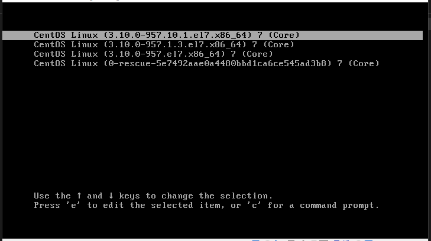
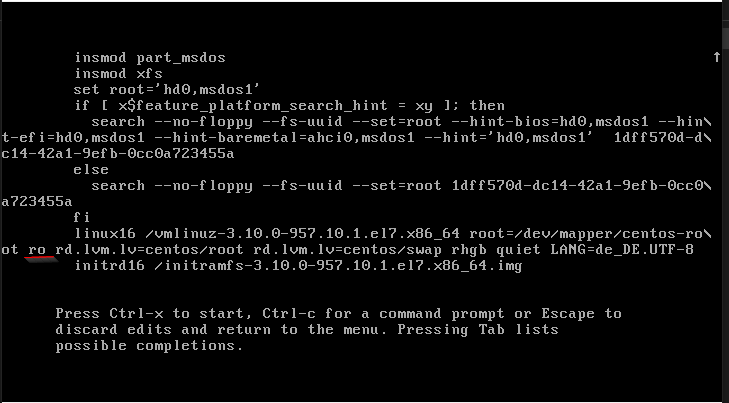
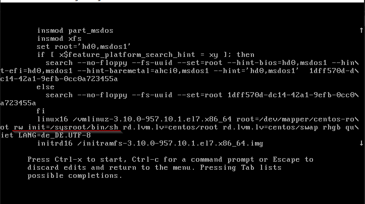



In the event you forget the root password on your Centos 7 system, there's no need to panic. You can reset it using the GRUB bootloader. This guide will walk you through the process of resetting your root password, step by step.

## Step 1: Accessing the GRUB Menu

Restart your computer and wait for the GRUB menu to appear.

Select the actual kernel you use, then press e to edit the boot parameters.



## Step 2: Modifying Boot Parameters
In the edit mode, navigate to the line that starts with ``linux 16``.

Change the ``ro`` (read-only) parameter to ``rw init=/sysroot/bin/sh``, which will allow you to boot into single-user mode with read-write access.

Before:


After: 



## Step 3: Booting into single user mode

Press ``Ctrl+X`` to start the system in single-user mode.

Once in single mode, you'll have limited access to the system. The following command changes your root directory to the system root:

````
chroot /sysroot
````

## Step 5: Changing the root password and updating SELinux information
Now, you can change the root password using the passwd command:

````bash
passwd root
````

After changing the root password, it’s crucial to update SELinux information. Create an empty ``.autorelabel`` file in the root directory:

````bash
touch /.autorelabel
````


## Final steps

Once you've completed these steps, exit single-user mode to reboot your system. And try your new password


