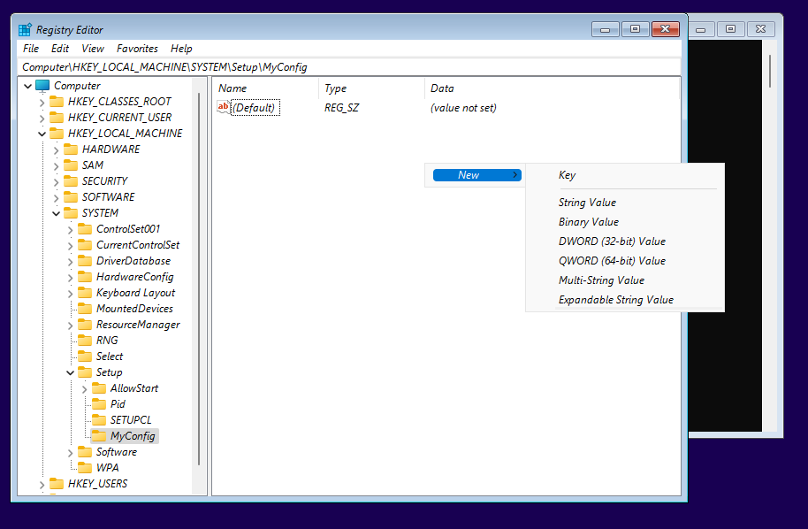



## Problem
Today I tried to install Windows 11 on my virtual platform and during installation faced with the following problem:

## Solution

In this screen type ``Shift + F10`` at the same time to open a command promt. Then in command line type ``regedit``:

In the opened Registry Editor window, go to HKEY_LOCAL_MACHINE -> SYSTEM -> Setup.

Right click on Setup and then create a New -> Key. Give some name to created key. I named it "MyConfig". **!!!! Give "LabConfig" name. !!!**

Click right button on the blank space of the window and choose: New -> DWORD (32-bit) Value.

Rename created value to BypassTPMCheck. Thenk double-click on the on the created object and change Value date to 1.

Create more DWORDS values and give them following names: BypassCPUCheck, BypassRAMCheck and BypassSecureBootCheck. The value data of all created objects should be 1.

Close all opened windows. 

And click on "Install now" button.

That's it.



## Reference:
[How to Fix Cannot Install Windows 11 on VMware Workstation](https://www.youtube.com/watch?v=sCLJYNI77Bk)

