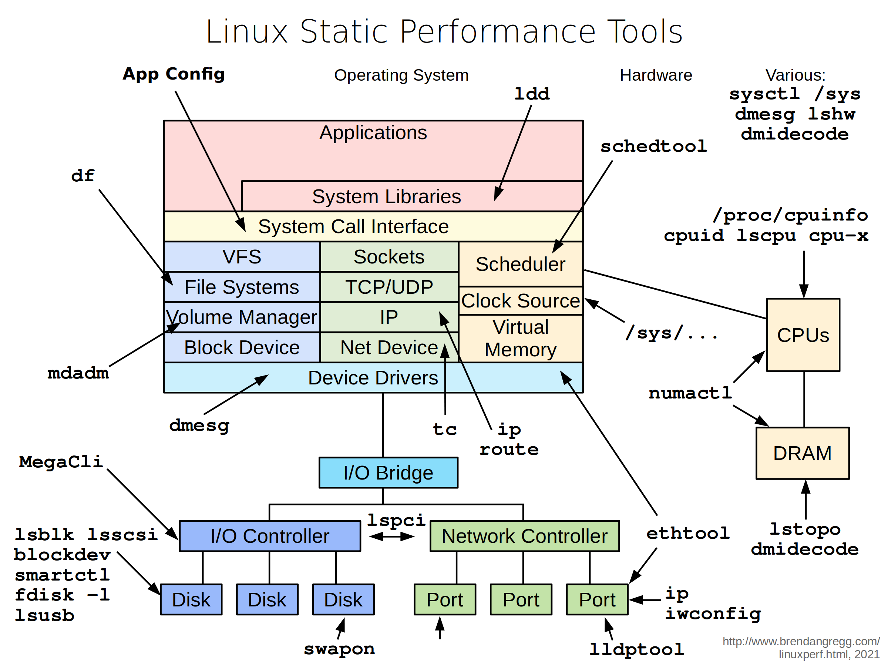
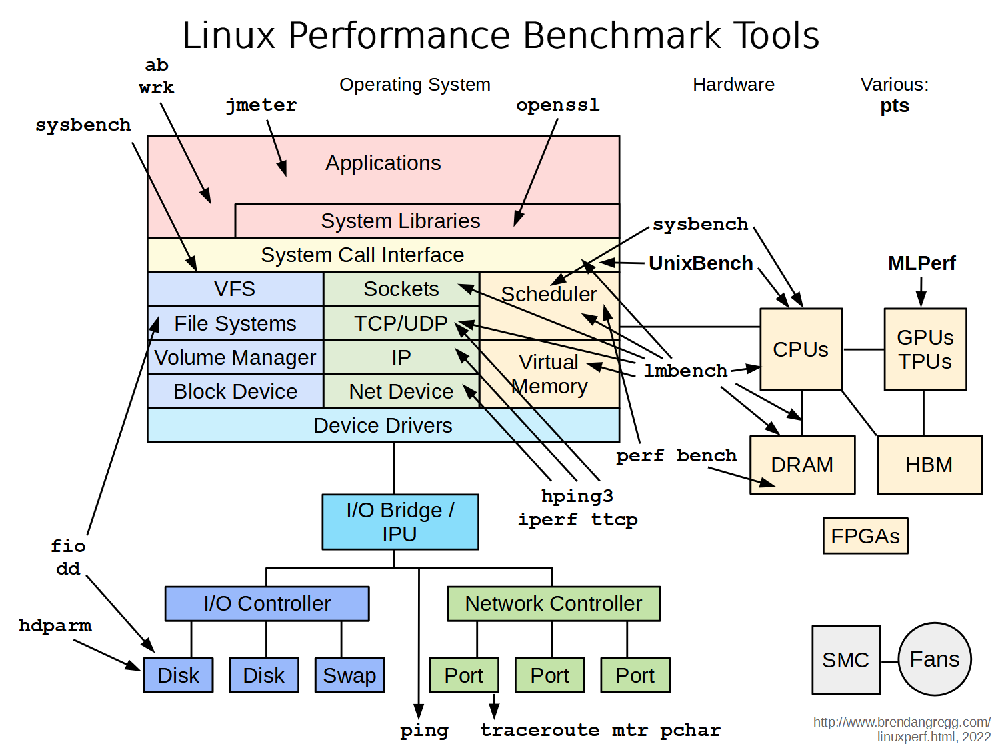



Below are graphics that show tools used to observe and monitor the performance of a Linux system.

The monitoring tools displayed are among the most important ones used by system engineers to retrieve system information. Additionally, the output from these tools is utilized by monitoring systems to visualize the system's current state.

## Linux Performance Tools

## Linux Static Performance Tools

## Linux Performance Benchmarking Tools

## Linux Performance Tuning Tools

## Reference
- [https://www.brendangregg.com/linuxperf.html](https://www.brendangregg.com/linuxperf.html)

